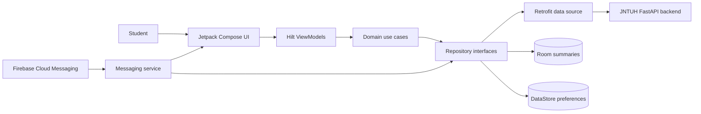
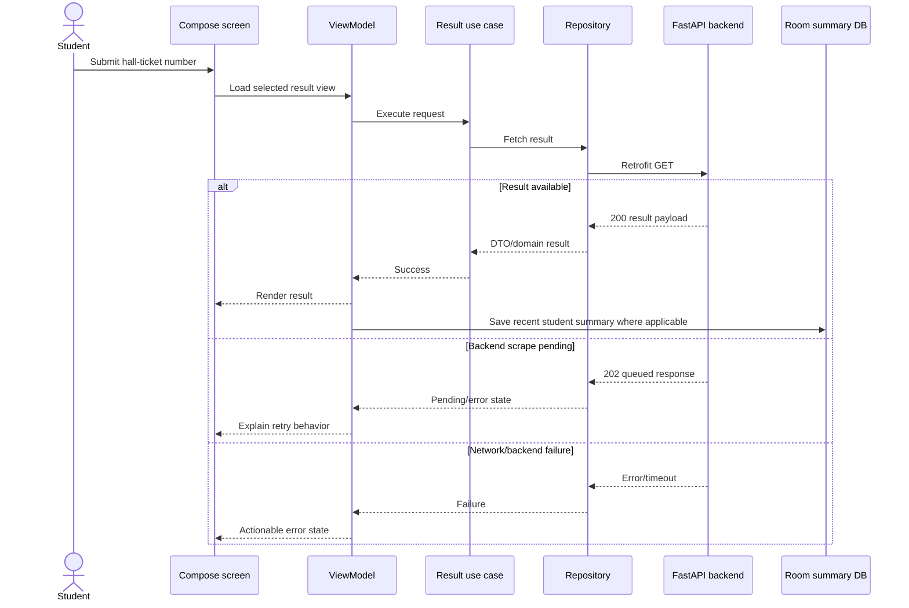

# JNTUH Connect Android Architecture

## Purpose

This repository is the native Android client for the JNTUH Connect platform. Student results are the primary flow; notifications, content, jobs, grace marks, and profile tools build on the same backend and local app foundation.

## System context

## Layers

### Presentation

`presentation/` contains the Compose navigation shell, screens, reusable components, theme, and `@HiltViewModel` state holders. ViewModels launch domain use cases and expose loading/success/error state to composables. `MainActivity` owns the root navigation and notification destination handling.

Feature packages include student results, class rankings, contrast, grace marks, updates, calendars/syllabus, careers, explore, profile, and home.

### Domain

`domain/model/` defines app-facing result/content types. `domain/repository/` defines boundaries independent of Retrofit and Room. `domain/use_case/` provides focused operations for result views, content, recent students, and mutations.

Keep business decisions such as roll validation, ranking, filtering, and response-to-domain mapping outside composables.

### Data

- `data/remote/JntuhConnectApi.kt`: Retrofit endpoint contract and DTOs.
- `data/repository/JntuhResultsRepositoryImpl.kt`: remote result/content adapter.
- `data/repository/NotificationRepository.kt`: FCM topic and per-roll subscription coordination.
- `data/local/database/`: Room database for student summary/history convenience data.
- `data/local/preferences/AppPreferences.kt`: theme, notification opt-in, random device ID, subscribed rolls, and recent document shortcuts.

Hilt modules in `di/` construct the database, Retrofit client, API, and repositories.

## Result flow

The mobile client never scrapes JNTUH directly. It relies on the backend to cache, persist, queue, and refresh results.

## Networking

`BuildConfig.API_BASE_URL` is:

- Debug: `http://10.0.2.2:8000/api/` for an Android emulator reaching the development host.
- Release: `https://jntuhresults.dhethi.com/api/`.

Debug permits cleartext traffic through `app/src/debug/AndroidManifest.xml`; release does not opt into it. The shared OkHttp client uses 15-second connect, 30-second read, and 40-second total call timeouts.

The backend recognizes Android's OkHttp/Dalvik User-Agent compatibility bypass. One jobs call also sends a public `X-Api-Key` default. Neither mechanism is user authentication; privileged backend operations must use server-held authorization.

## Local persistence

Room stores `StudentDetailsEntity` summaries for recent student convenience. It does not replace the backend's authoritative mark store. DataStore persists theme/notification preferences, a random result-notification device ID, subscribed roll numbers, and up to two recent documents that expire after 24 hours.

Schema changes require an explicit Room migration or a deliberate destructive-development strategy; do not silently change the database version in production.

## Notifications

Firebase provides:

- The `result-updates` topic for release broadcasts.
- Device FCM tokens registered with backend per-roll subscriptions.
- `MyFirebaseMessagingService` for token refresh, payload handling, notification channels, and navigation destinations.

The repository restores topic state and re-registers subscribed rolls after token rotation. Notification permission is requested at runtime on Android 13+.

## Build and release

Gradle version catalogs pin plugins/libraries. Release builds enable R8/resource shrinking and full native debug symbols. `app/version.properties` holds the base version code:

- Debug/local non-release builds do not mutate it.
- Local release tasks increment the file.
- GitHub Actions derives a monotonic code from the base plus `GITHUB_RUN_NUMBER` without changing the file during the build.

Every push to `main` triggers the signed Play internal-track release workflow, followed by a bot README version-badge commit.

## Architectural invariants

- Backend result DTO changes must update mappings, domain models, ViewModels, and tests together.
- Room/DataStore are convenience stores, not authoritative academic data.
- Preserve release HTTPS and debug-only cleartext.
- FCM/admin/server credentials never belong in the APK.
- Handle 202/pending, rate-limit, offline, timeout, decoding, and empty states explicitly.
- Compose screens should consume state and events rather than call Retrofit directly.
- Keep signing/version automation aligned with the Play workflow.
